# Parking management system flutter

The Parking Management System is a mobile application built with Flutter to manage parking lots and parking slots.
This system provides tools for creating, monitoring,
and managing parking lots, allocating parking slots, and keeping track of parked vehicles.

## Features

- **Parking Lot Management**: Create multi-level parking lots with dedicated slots catering to various car sizes.
- **Deletion of Parking Lots**: Effortlessly remove existing parking lots from the system.
- **Slot Availability**: Quickly identify available parking slots for accommodating new vehicles.
- **Slot Release**: Seamlessly release parking slots when they are no longer in use.

## Getting Started

These instructions will help you get a copy of the project up and running on your local machine for development and testing purposes.

### Prerequisites

- [Flutter SDK](https://flutter.dev/docs/get-started/install): Make sure you have Flutter installed.

### Installing

1. Clone the repository:

   ```shell
   git clone https://github.com/akxhay/parking_management.git
   ```

2. Change the working directory:

   ```shell
   cd parking_management
   ```

3. Get dependencies:

   ```shell
   flutter pub get
   ```

### Running the App

1. Ensure an emulator or a physical device is connected.
2. Run the app:

   ```shell
   flutter run
   ```

## Screenshots

#### App icon

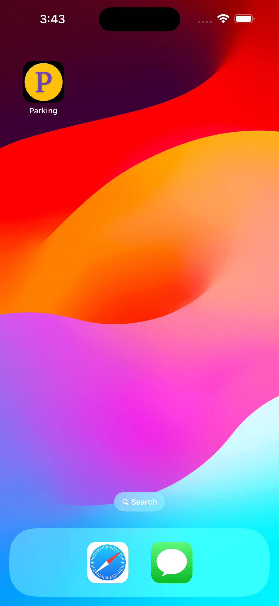

#### Splash screen


#### No parking lot available

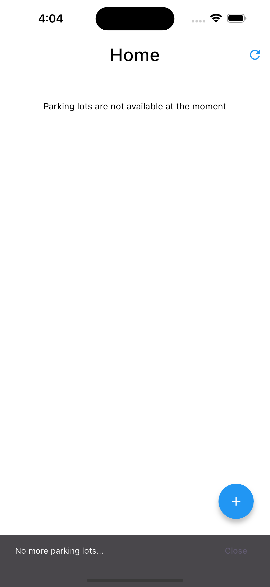

#### Parking lots pageable

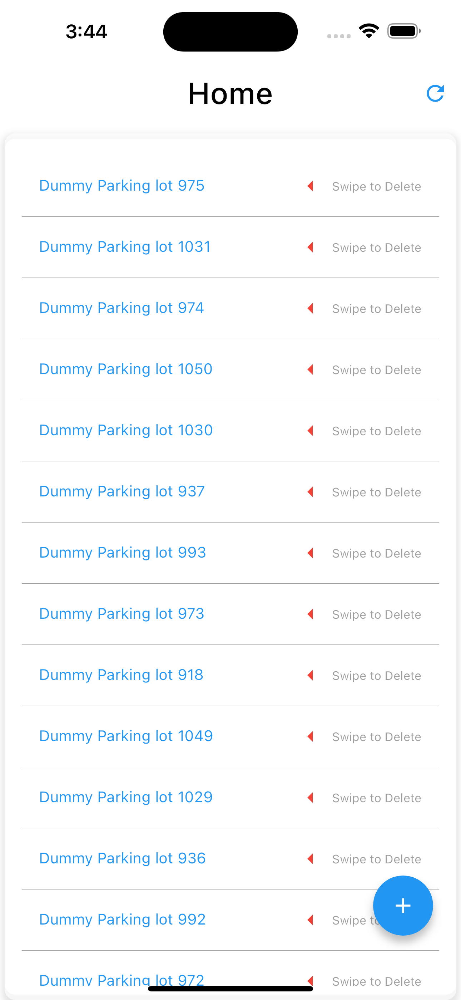

#### Add a new Parking lot by clicking on (+) floating icon

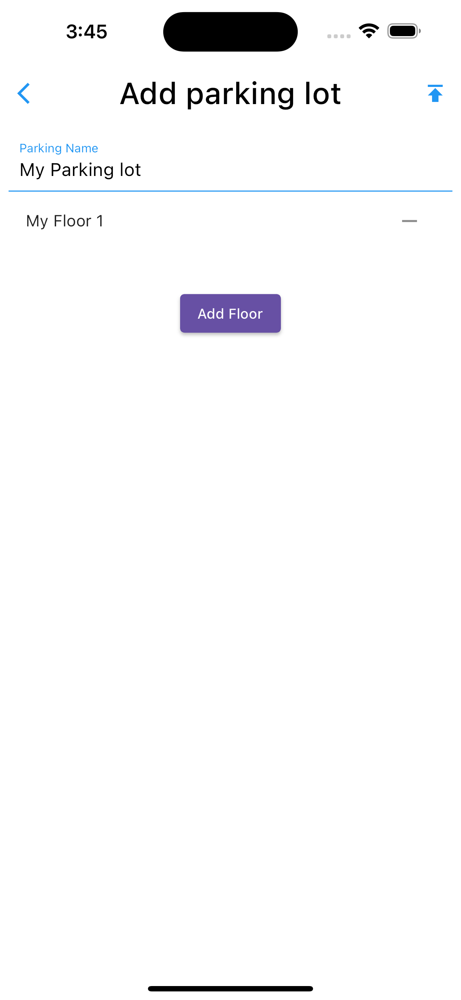

#### Add or update a floor

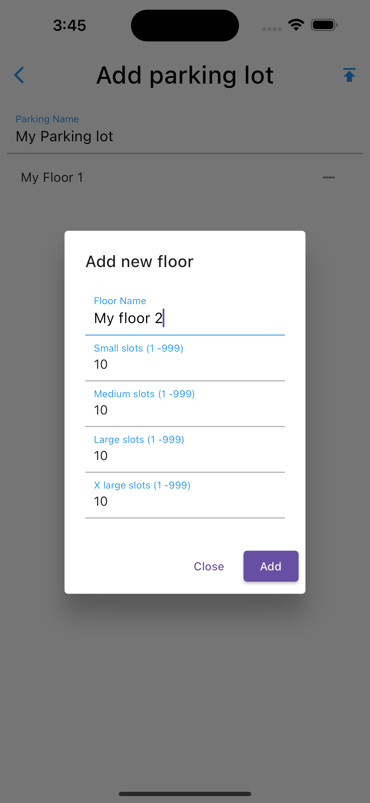

#### Updated list after adding a parking lot

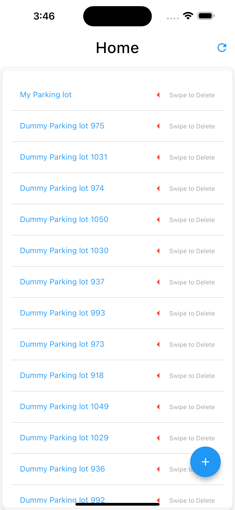

#### You can swipe and delete the parking slot

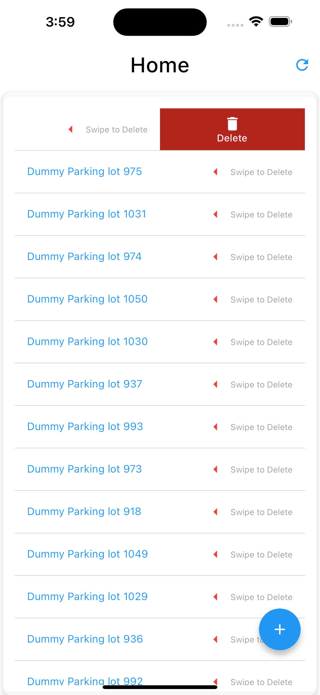

#### Click on any item open parking lot information


#### Click (P) to floating icon to park a new car


#### Choose a car type

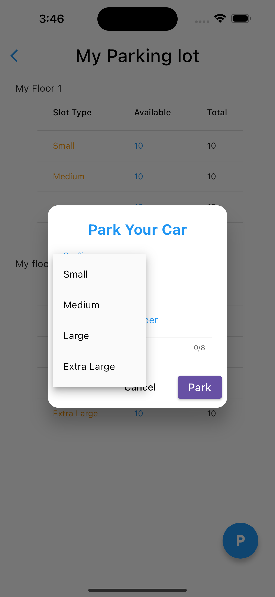

#### Enter number plate


#### Click park to park your car, you will get an arrival receipt

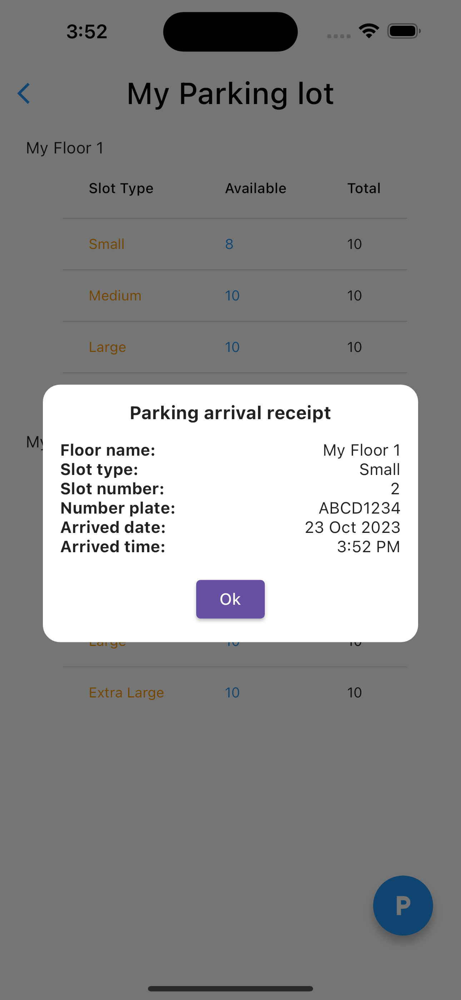

#### There can be a situation where all slots are occupied


#### You will get error while parking your car


#### Click on any floor to get slots info on the floor, You will get size wise slots and where red means occupied and white

means free
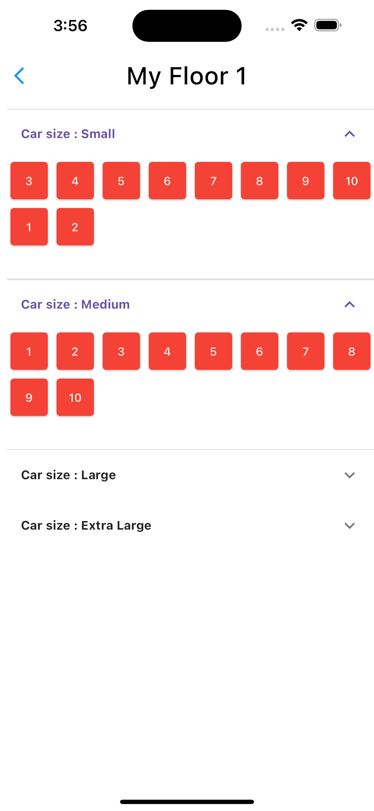

#### Click on any occupied slot to get departure receipt where the parking bill will be charged.

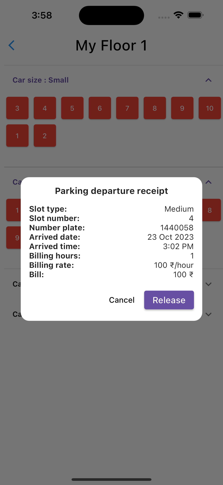

#### Released medium slot

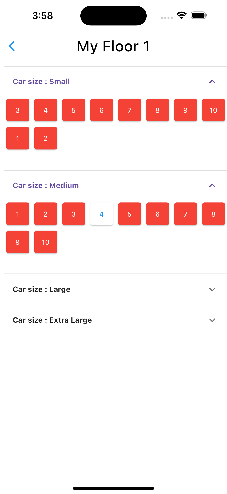

#### Free slot is available for a new car

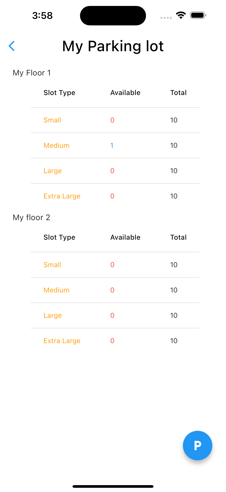

#### Try parking a large car in a medium slot


#### You will not be able to get a free slot

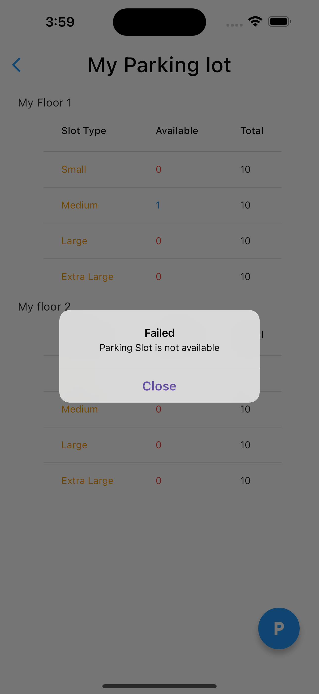

#### Try parking a small car in a medium slot

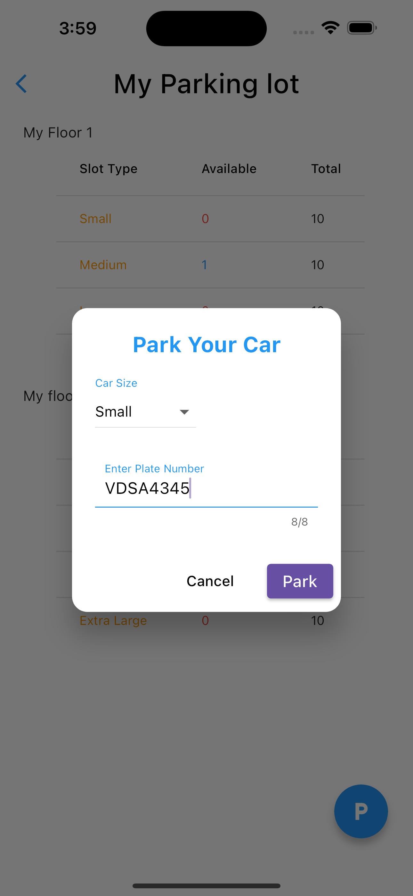

#### You will not be able to park successfully

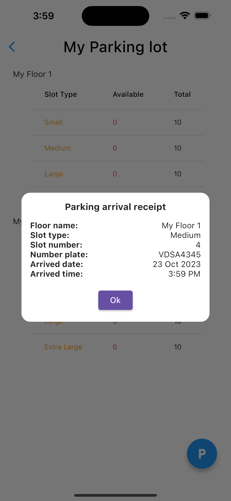

Thank you. 😄